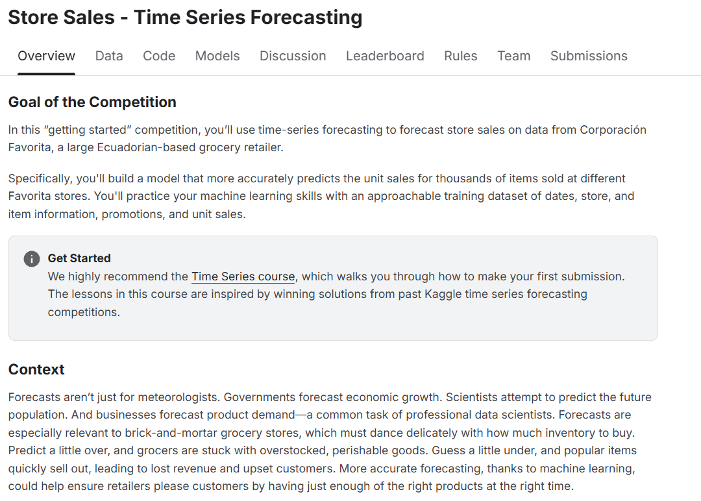
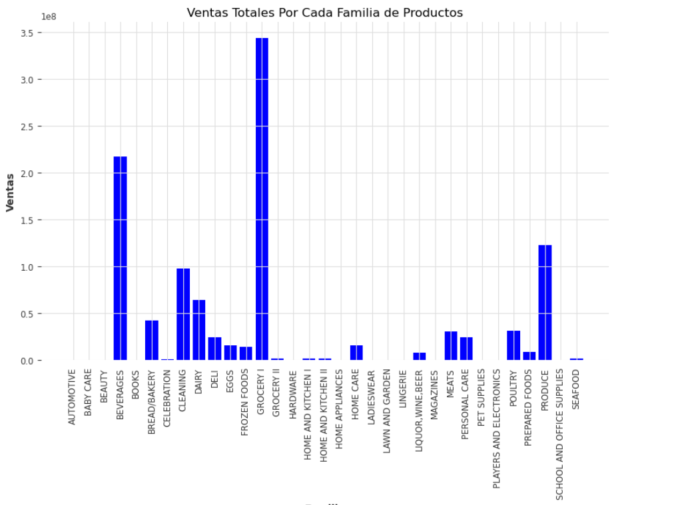
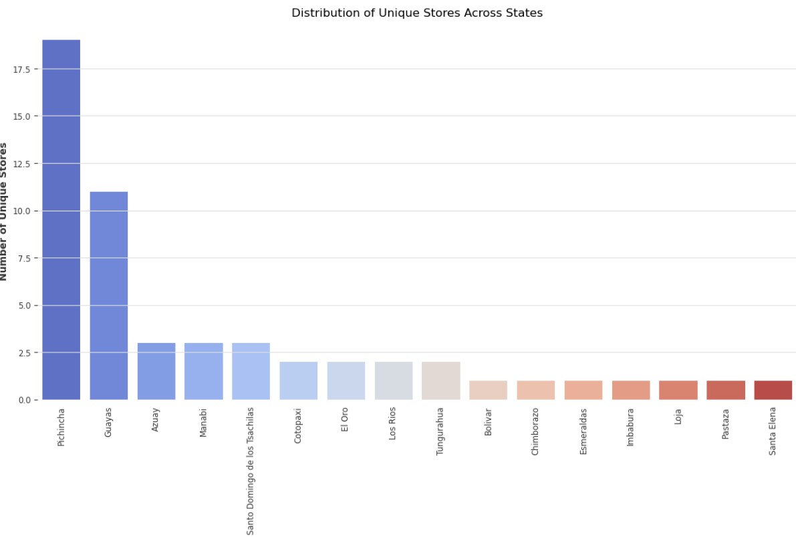
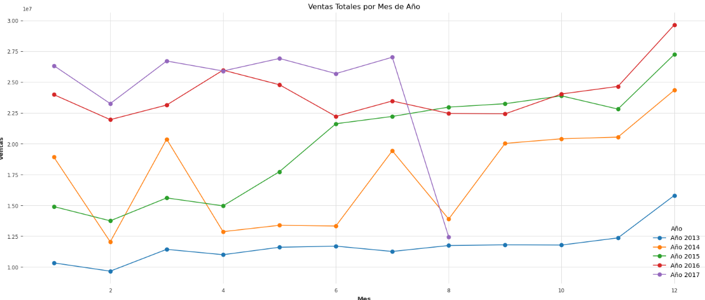
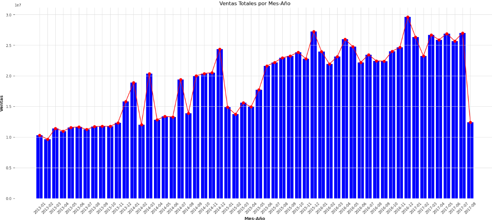
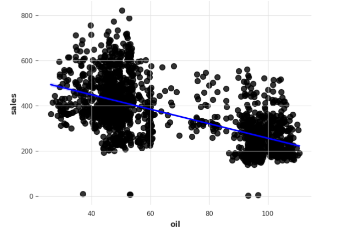
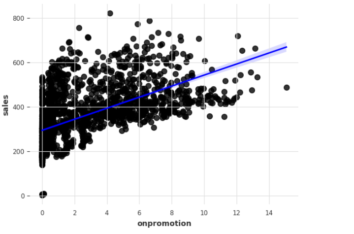
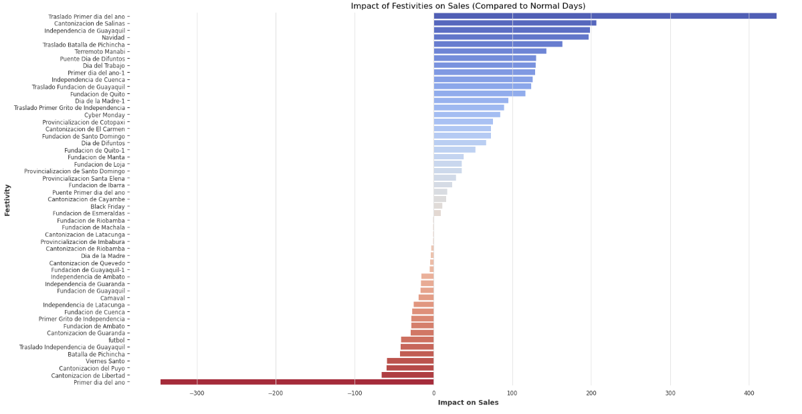
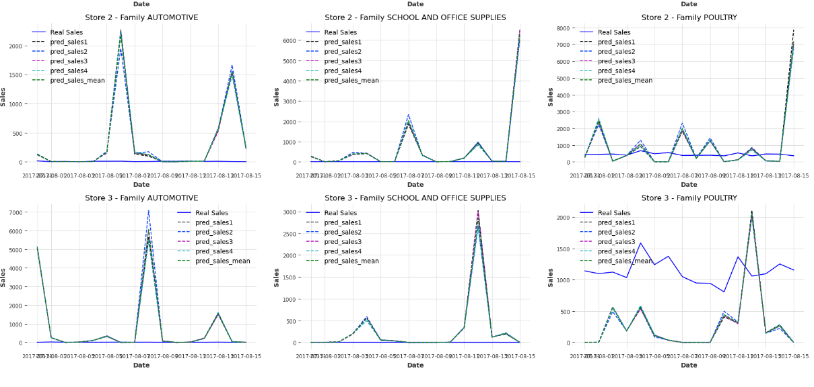
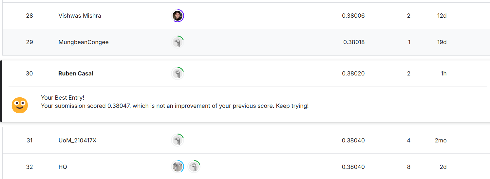

# Sales Prediction with Time Series Analysis

Este proyecto aborda el desafío propuesto por una competencia de Kaggle, donde se busca predecir las ventas de distintas familias de productos en múltiples tiendas de Favorita, una cadena ubicada en Ecuador. Utilizando técnicas de series de tiempo, el objetivo es desarrollar un modelo que permita estimar las ventas futuras a partir de datos históricos, lo cual es crucial para mejorar la planificación de inventarios, gestionar promociones y optimizar el suministro de productos.

La solución incluye una serie de modelos predictivos que se entrenan con datos que incorporan factores como promociones, transacciones históricas, fluctuaciones de precios de petróleo y eventos especiales. Este enfoque permite capturar los patrones y tendencias en las ventas, ofreciendo una herramienta valiosa para la toma de decisiones en un entorno comercial dinámico.

  

## Índice

1. [Data Cleaning](#data-cleaning)
2. [Exploratory Data Analysis (EDA)](#exploratory-data-analysis-eda)
3. [Training Preparation](#training-preparation)
    - [Creación de Series de Tiempo Objetivo y Covariables](#creación-de-series-de-tiempo-objetivo-y-covariables)
    - [Generación de Covariables de Promociones y Festividades](#generación-de-covariables-de-promociones-y-festividades)
    - [Construcción de Pipelines de Transformación](#construcción-de-pipelines-de-transformación)
4. [Training and Evaluation](#training-and-evaluation)
    - [Configuración del Modelo](#configuración-del-modelo)
    - [Entrenamiento del Modelo](#entrenamiento-del-modelo)
    - [Predicciones y Evaluación de Resultados](#predicciones-y-evaluación-de-resultados)
    - [Promedio de Predicciones](#promedio-de-predicciones)
    - [Visualización de Resultados](#visualización-de-resultados)
5. [Final Training and Submission](#final-training-and-submission)
    - [Entrenamiento Final del Modelo](#entrenamiento-final-del-modelo)
    - [Generación de Predicciones para Submission](#generación-de-predicciones-para-submission)
    - [Ensamblaje de Predicciones](#ensamblaje-de-predicciones)
    - [Preparación del Archivo para Submission](#preparación-del-archivo-para-submission)
   
## Data Cleaning

En el proceso de limpieza de datos, se realizaron los siguientes pasos clave:

- **Imputación de Valores Nulos**: Se completaron los valores faltantes en las series temporales utilizando técnicas de imputación específicas de la librería `darts`, asegurando una continuidad en los datos.
- **Codificación y Transformación**: Se transformaron variables categóricas como `store_nbr` y `family` mediante codificación (encoding) para hacerlas compatibles con los modelos.
- **Escalado de Variables**: Se aplicó escalado a las variables numéricas para mejorar el rendimiento y estabilidad del modelo durante el entrenamiento.
- **Generación de Nuevas Características**: Se crearon nuevas variables temporales, como días festivos y atributos de tendencia estacional, para enriquecer los datos y capturar patrones estacionales en las ventas.

## Exploratory Data Analysis (EDA)

Durante la exploración de datos, se realizaron los siguientes análisis:

- **Análisis Estadístico Descriptivo**: Se calculó el rango de fechas, el número de tiendas, familias de productos, y combinaciones únicas de tienda y producto, proporcionando una visión general de la estructura del conjunto de datos.

  
  &nbsp;&nbsp;&nbsp;&nbsp;&nbsp; <!-- Ajusta la cantidad de espacios para simular el margen -->
  

  
- **Visualización de Ventas a lo Largo del Tiempo**: Se generaron gráficos de líneas para visualizar tendencias generales y estacionalidad en las ventas de diferentes familias de productos y tiendas.
 

  
  &nbsp;&nbsp;&nbsp;&nbsp;&nbsp; <!-- Ajusta la cantidad de espacios para simular el margen -->
  

- **Impacto de las Promociones y Pretróleo en las Ventas**: Se exploró la relación entre las promociones (`onpromotion`) y el precio del petróleo comparado con las ventas, analizando cómo afectan estas covariables al comportamiento de compra en distintas tiendas y productos.
    

  
  &nbsp;&nbsp;&nbsp;&nbsp;&nbsp; <!-- Ajusta la cantidad de espacios para simular el margen -->
  

  
- **Efecto de Eventos y Festividades**: Se investigó la influencia de eventos especiales y festivos en los picos de ventas, identificando variaciones estacionales y patrones de consumo relacionados con estos eventos. En este dataset hay una gran cantidad de festividades, incluirlas todas en las "features" del entrenamiento solo añadiría complejidad al entrenamiento sin aportar realmente un beneficio claro, por eso, gracias a este análisis se pueden incluir las festividades que tengan más repercusion en las ventas de las diferentes tiendas.

  

  

## Training Preparation

Antes de entrenar el modelo, se llevó a cabo una preparación exhaustiva de los datos para construir una serie de covariables que permitan capturar mejor los patrones temporales en las ventas. Este proceso incluye la creación de series de tiempo específicas para las variables de entrada y la definición de pipelines para transformar los datos de forma eficiente. Los pasos clave fueron los siguientes:

### Creación de Series de Tiempo Objetivo y Covariables

- **Series de Tiempo Objetivo**: Se generaron series de tiempo para las ventas de cada familia de productos en cada tienda, permitiendo que el modelo enfoque las predicciones en cada combinación de tienda y familia.
- **Covariables Futuras**: Se crearon covariables basadas en atributos temporales como el año, mes, día, día de la semana y eventos de calendario (festivos o fechas especiales). También se añadieron medias móviles de los precios del petróleo (7, 14 y 28 días) para capturar patrones de tendencia.
- **Covariables Pasadas**: Se incluyeron transacciones previas como covariables, proporcionando al modelo información sobre el comportamiento histórico relevante para las predicciones.

### Generación de Covariables de Promociones y Festividades

- **Eventos y Festividades**: Se generaron series de tiempo para cada tienda, representando eventos como promociones, días festivos nacionales y eventos locales (e.g., el Día de la Madre). Estos eventos se agregaron como variables binarias indicando si ocurrieron en una fecha específica.
- **Promociones**: Se procesaron con medias móviles (7, 14 y 28 días) para proporcionar al modelo el efecto acumulativo de las promociones en el tiempo.

### Construcción de Pipelines de Transformación

Para facilitar la normalización y transformación de las series de tiempo, se creó una **pipeline de transformación** que incluye pasos para:

- **Rellenar Valores Faltantes**: Uso de `MissingValuesFiller` para garantizar que no haya huecos en las series de tiempo.
- **Transformación Logarítmica**: Aplicada en los datos de ventas para estabilizar la variabilidad y mitigar el impacto de valores atípicos.
- **Escalado de Datos**: Normalización de las series de tiempo con `Scaler` para asegurar consistencia en las variables.
- **Codificación de Covariables Estáticas**: Transformación de variables como el tipo de tienda y ubicación mediante one-hot encoding.

## Training and Evaluation

### Configuración del Modelo

Se establecieron varias combinaciones de parámetros de retrasos (**lags**) para series de tiempo objetivo, covariables futuras y covariables pasadas. Estas configuraciones permiten al modelo capturar patrones de diferentes períodos, desde semanales hasta anuales, considerando factores temporales de corto y largo plazo.

Las configuraciones específicas probadas fueron:

1. **Configuración 1**:
   - `lags`: 63 (retrasos de hasta 63 días para la serie de ventas)
   - `lags_future_covariates`: (14, 1) (covariables futuras con retrasos de 14 días y ventana de 1 día)
   - `lags_past_covariates`: [-16, -17, -18, -19, -20, -21, -22] (retrasos en covariables pasadas como transacciones)

2. **Configuración 2**:
   - `lags`: 7 (retrasos de hasta 7 días para la serie de ventas)
   - `lags_future_covariates`: (16, 1)
   - `lags_past_covariates`: [-16, -17, -18, -19, -20, -21, -22]

3. **Configuración 3**:
   - `lags`: 365 (retrasos de hasta 365 días, capturando patrones anuales)
   - `lags_future_covariates`: (14, 1)
   - `lags_past_covariates`: [-16, -17, -18, -19, -20, -21, -22]

4. **Configuración 4**:
   - `lags`: 730 (retrasos de hasta 730 días, capturando patrones bienales)
   - `lags_future_covariates`: (14, 1)
   - `lags_past_covariates`: [-16, -17, -18, -19, -20, -21, -22]

### Entrenamiento del Modelo

- Para cada combinación de parámetros, se entrenó un modelo `LightGBMModel` específico para cada familia de productos, para que cada modelo pueda especializarse en predecir un conjunto de datos que siga una dinámica similar y de esta forma conseguir predicciones más precisas (54 modelos en total).
- Durante el entrenamiento, se dividieron los datos en conjunto de entrenamiento y validación, asegurando que las predicciones se realizaran sobre datos de validación no vistos.
- Se utilizó la GPU para acelerar el proceso, gracias a la implementación de `LightGBMModel` en `darts`.

### Predicciones y Evaluación de Resultados

- Tras el entrenamiento, se generaron predicciones para el período de validación (16 días). Se aplicaron transformaciones inversas para devolver los valores a su escala original.
- Ajustes en las predicciones para series de ventas recientes sin actividad.

### Promedio de Predicciones

Para reducir la variabilidad, se calculó el promedio de todas las predicciones generadas con las configuraciones de parámetros. Esta técnica de ensamblaje mejoró la estabilidad y precisión de las predicciones finales.

### Visualización de Resultados

Se graficaron las ventas reales y las predicciones para comparar el rendimiento en diferentes tiendas y familias. La gráfica muestra las ventas reales y las predicciones de varias configuraciones, observando el ajuste de las predicciones a los patrones de ventas.

Esta etapa de entrenamiento y evaluación permitió identificar los mejores parámetros y robustecer las predicciones finales, esenciales para una predicción precisa en ventas.

  

  

## Final Training and Submission

En la fase final de entrenamiento y generación de predicciones para la **submission**, se llevó a cabo un entrenamiento completo de los modelos utilizando todas las observaciones disponibles en el conjunto de datos y se generaron las predicciones necesarias para la competencia. El proceso incluyó configuraciones de parámetros optimizadas para cada modelo, asegurando una predicción precisa de las ventas.

#### Entrenamiento Final del Modelo

- **Corte Temporal para Entrenamiento**: Se definió una fecha de corte (`cutoff_date`) para utilizar solo los datos relevantes en el entrenamiento, comenzando desde enero de 2015 en adelante.
- **Entrenamiento por Familia de Productos**: Se entrenó un modelo `LightGBMModel` para cada familia de productos, utilizando las configuraciones de parámetros antes mencionadas y las covariables relevantes. Esto permitió que cada familia de productos tenga un modelo especializado adaptado a sus patrones de ventas.
- **Almacenamiento de Modelos**: Cada modelo entrenado se almacenó en un diccionario estructurado por configuración de parámetros y familia de productos, facilitando la organización y posterior acceso para realizar predicciones.

#### Generación de Predicciones para Submission

- **Predicción con Todas las Configuraciones**: Se utilizaron los modelos entrenados para generar predicciones sobre el conjunto de prueba para cada configuración de parámetros. Estas predicciones se almacenaron y posteriormente se aplicaron transformaciones inversas para devolver los valores a su escala original.
- **Ajustes para Ventas Nulas**: En los casos donde las ventas recientes en la serie de tiempo objetivo eran cero, se ajustaron las predicciones para reflejar mejor la falta de actividad en esos períodos, asignando predicciones cercanas a cero.

#### Ensamblaje de Predicciones

- **Promedio de Predicciones**: Se calculó el promedio de todas las predicciones generadas para cada configuración de parámetros, reduciendo la variabilidad y mejorando la estabilidad y precisión de la predicción final.
- **Ajuste de Predicciones Negativas**: Para asegurar la coherencia de las predicciones, se eliminaron los valores negativos, estableciéndolos en cero donde fuera necesario.

#### Preparación del Archivo para Submission

- **Combinación de Predicciones**: Todas las predicciones se consolidaron en un único DataFrame, y el promedio de las predicciones se añadió como la columna `pred_sales_mean`.
- **Formato para Submission**: Finalmente, el archivo de submission se generó utilizando la plantilla `sample_submission.csv`, donde la columna `sales` se llenó con las predicciones promediadas (`pred_sales_mean`).
- **Exportación del Archivo**: El archivo resultante se guardó como `submission24.csv` y está listo para ser subido a Kaggle para la evaluación final.

Este enfoque de ensamblaje y ajuste final asegura una predicción robusta, consiguiendo una posicion 30/773 en la competencia de Kaggle.

  

  

